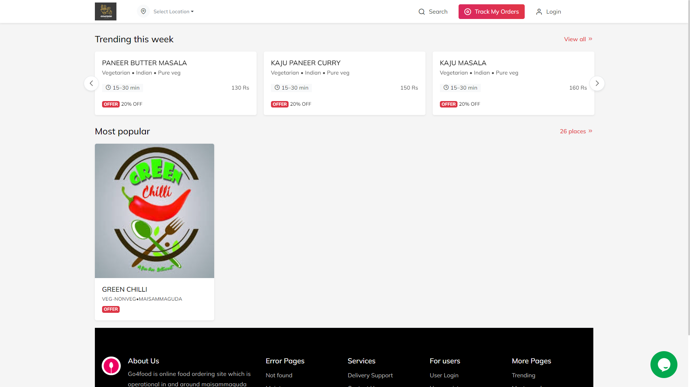
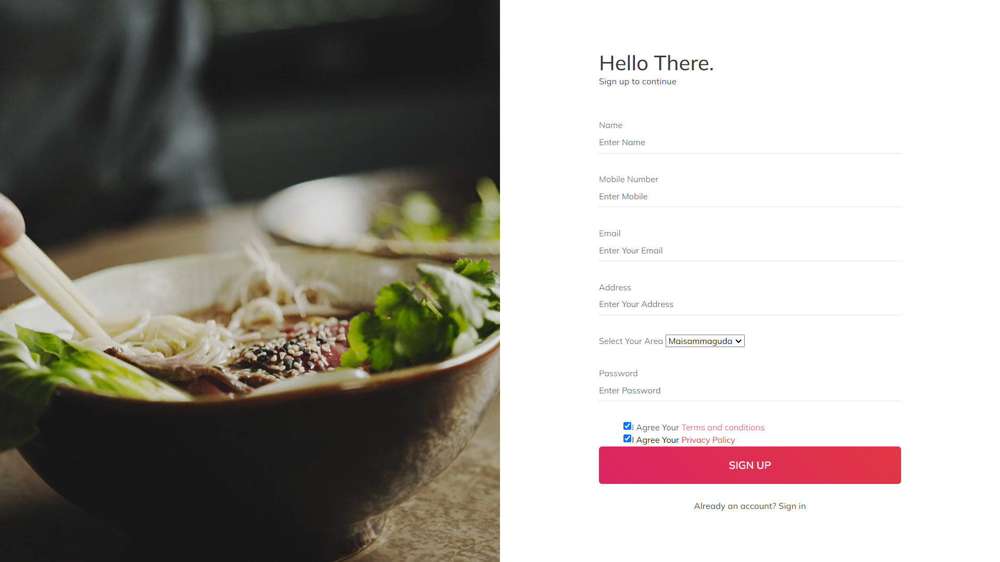
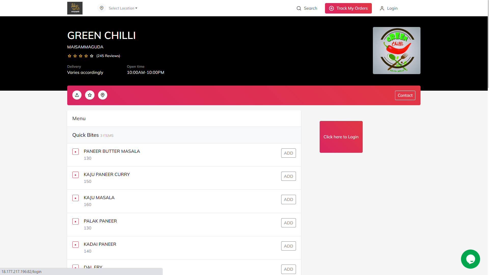
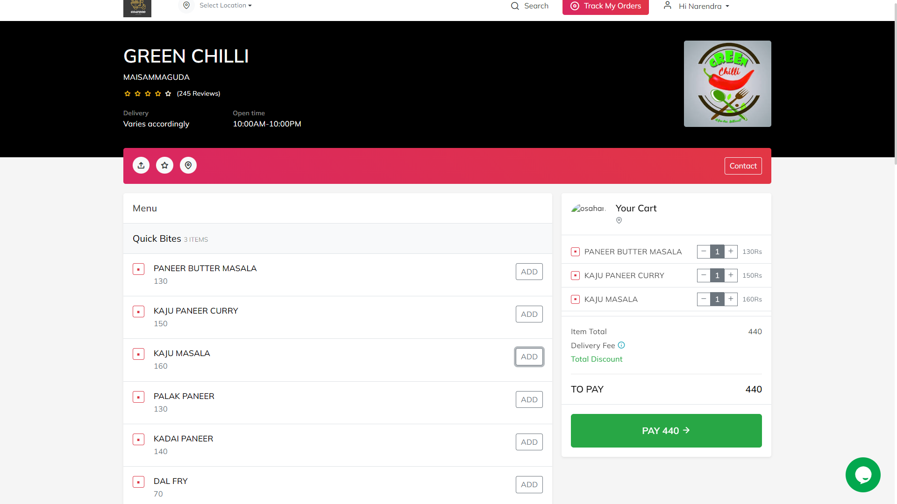
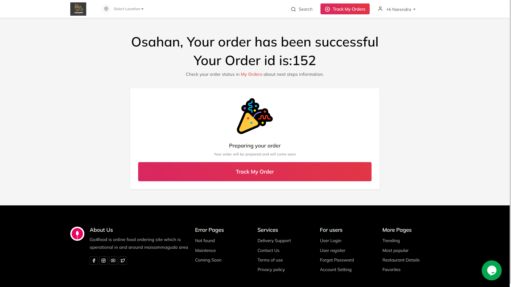
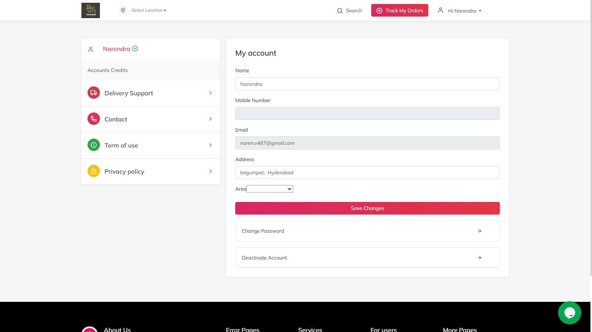
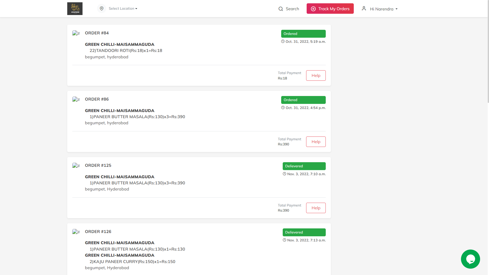
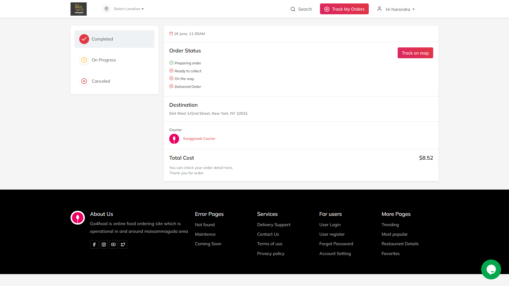

# 🍽️ Go4Food
Go4Food is a Django project. It is a web-based application designed to facilitate online food ordering and delivery, similar to platforms like Zomato and Swiggy.
<br>

### 🚀 Features

- 🛒 Browse Restaurants and Menus – Users can explore available restaurants and food items.
- 📦 Order Management – Place and track food orders in real time.
- 🧾 Cart and Checkout – Add items to a cart and securely complete the purchase.
- 🧑‍🍳 Admin & Vendor Dashboard – Manage restaurants, menus, and order status.
<br>

## 🗂️ Project Structure
```bash
go4food/
├── go4food/ # Main Django project folder (settings, urls, wsgi, asgi)
│ ├── init.py
│ ├── settings.py # Project settings (DB, middleware, installed apps, etc.)
│ ├── urls.py # URL routing for the project
│ ├── wsgi.py # WSGI entry point
│ ├── asgi.py # ASGI entry point
│
├── apps/ # Custom Django apps for modular development
│ ├── orders/ # Orders app (models, views, urls, templates)
│ ├── users/ # Users app (authentication, profiles, JWT integration)
│ ├── menu/ # Menu/food items app (CRUD for food items)
│ └── ...
│
├── templates/ # Global HTML templates
├── static/ # Static files (CSS, JS, images)
├── manage.py # Django management script
├── requirements.txt # Python dependencies
└── README.md # Project documentation


### 🛠️ Installation

- run `pip install -r requirements.txt`
- run `python manage.py migrate`
- run `python manage.py createsuperuser` (to create admin account)
<br>

### 🚀 Run the Project

- run `python manage.py runserver`
- Open `http://127.0.0.1:8000/` in your browser
<br>

### 🖼️ Screenshots

**Home Page**


**Login Screen**


**SignUp Page**


**Order Page**


**Cart Page**


**Order Success**


**My Account**


**Track Order**


**Order Status Page**



<br>

### 📦 Tech Stack

- Python  
- Django  
- HTML/CSS/Bootstrap  
- SQLite / PostgreSQL  
<br>

### 👥 Contributors

- Narendra Kumar
